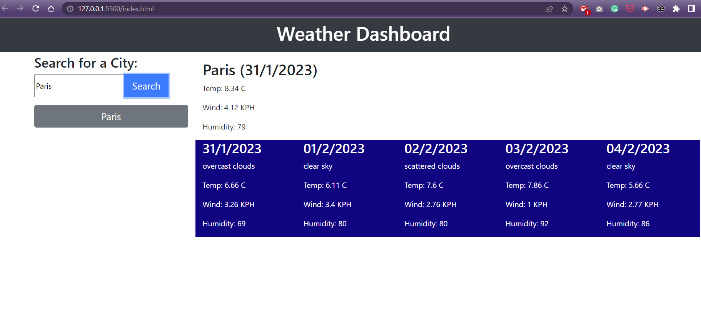
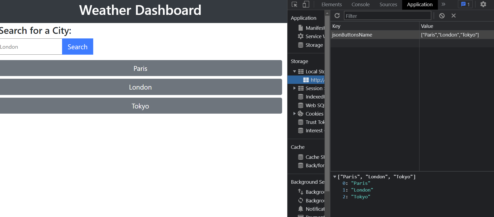

# Module `8` Challenge: Weather-Dashboard

## Description

This app functions as a weather dashboard. The code queries OpenWeather apis and returns the current weather, as well as a five day forecast for the city searched by the user.
The app also stores the cities in local storage, so the user don't need to write the city on the search input every time he wants to check its weather.

## Deployment

The app was deployed using Github Pages and can be accessed [here](https://ortizlilian.github.io/weather-dashboard/).

## Screenshots

When the app is loaded on the browser it looks like this:

This is what shows when the user searchs a city weather:

Here the data saved to local storage:

## Acceptance Criteria

- When a user searches for a city they are presented with current and future conditions for that city and that city is added to the search history
- When a user views the current weather conditions for that city they are presented with:
    * The city name
    * The date
    * An icon representation of weather conditions
    * The temperature
    * The humidity
    * The wind speed
- When a user view future weather conditions for that city they are presented with a 5-day forecast that displays:
    * The date
    * An icon representation of weather conditions
    * The temperature
    * The humidity
- When a user click on a city in the search history they are again presented with current and future conditions for that city
- Uses the OpenWeather API to retrieve weather data.
- Uses localStorage to store persistent data.
- Application deployed at live URL.
